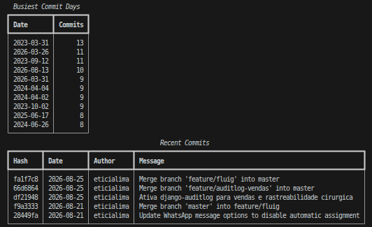

# Git Analyzer



Summarizes a Git repository with the standard library and the `git` command.

```bash
python -m venv .venv
source .venv/bin/activate
pip install -e .
git-analyzer --repo .
git-analyzer --repo /path/to/your/project --limit 5
```

It shows:

- total commits
- authors ranked by commit count
- current branch
- last commit
- most changed files
- busiest commit days
- recent commits
